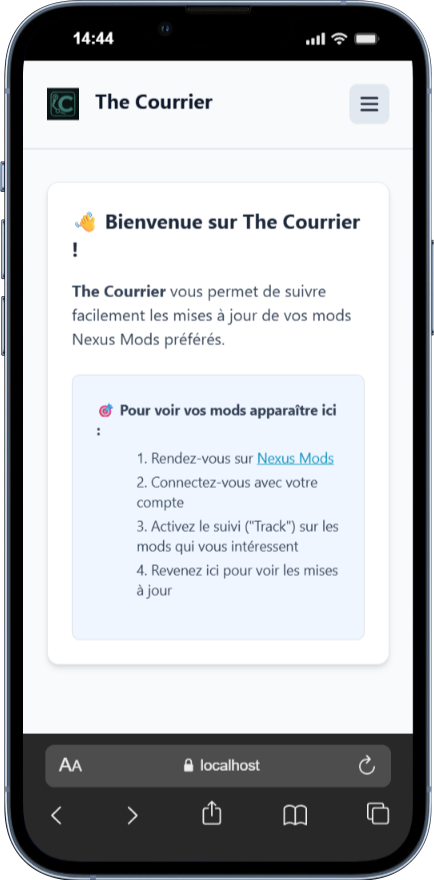
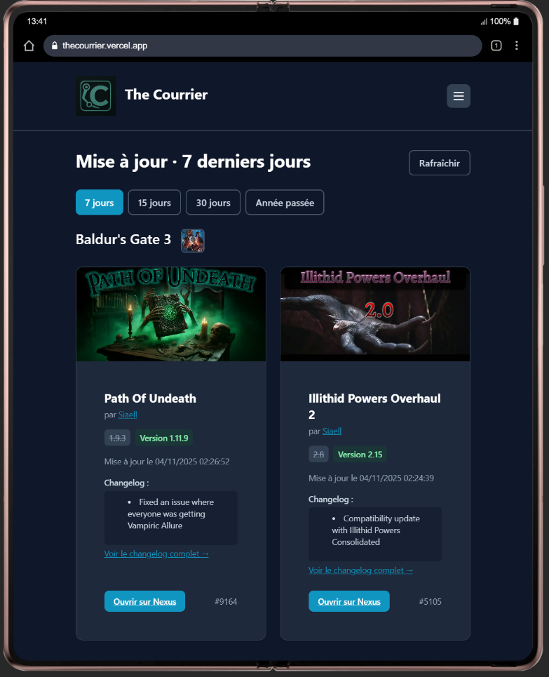
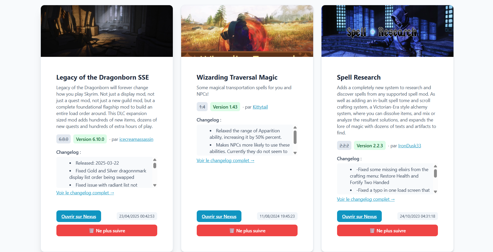
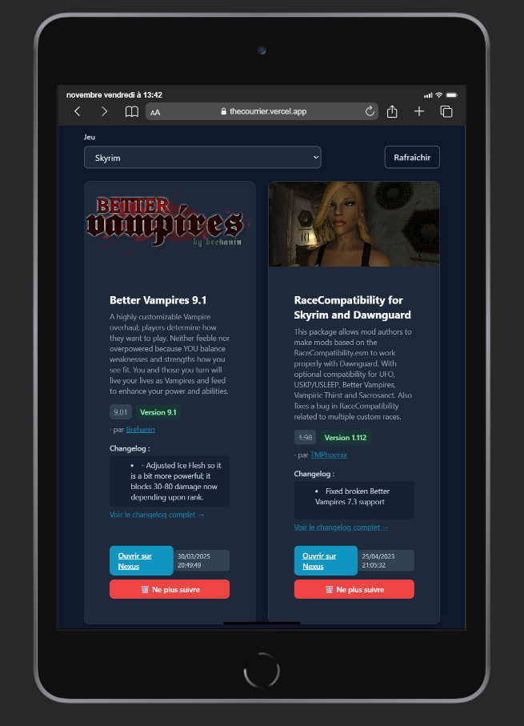
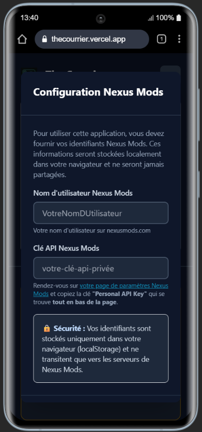

# The Courrier

> **WebApp de veille technologique pour les mods Nexus Mods avec intégration Steam**

Une application web moderne permettant de suivre et monitorer les mises à jour de vos mods favoris sur Nexus Mods. Profitez d'une interface épurée pour consulter les actualités, changelogs et gérer vos mods suivis par jeu. Inclut un tableau de bord complet, l'intégration Steam pour suivre les versions de jeux, et la détection d'incompatibilités entre mods.

[](https://react.dev/)
[](https://tailwindcss.com/)
[](https://nodejs.org/)

---

## Pitch du Projet

**The Courrier** est une webapp de **veille de données** pour les modifications (mods) de jeux vidéo hébergées sur Nexus Mods. Elle permet aux joueurs et moddeurs de :

- **Surveiller** les mises à jour de leurs mods favoris en temps réel
- **Analyser** les changelogs et historiques de versions
- **Organiser** leurs mods par jeu avec une interface intuitive
- **Être informés** des dernières nouveautés de la communauté modding
- **Suivre** les versions de jeux Steam et recevoir des alertes de mise à jour
- **Détecter** les incompatibilités potentielles entre mods

Contrairement à l'interface standard de Nexus Mods, The Courrier offre une expérience optimisée pour la veille avec :
- Tableau de bord centralisé avec statistiques et aperçu global
- Intégration Steam pour suivre les versions de jeux (Build ID, dates de MAJ)
- Alertes visuelles pour les mises à jour de jeux
- Détection d'incompatibilités entre mods avec suggestions de résolution
- Filtrage temporel avancé (7/15/30 jours, année)
- Affichage enrichi avec noms de jeux, icônes et catégories
- Badges "NEW" pour identifier les nouveautés
- Système de tri (date, nom, auteur)
- Gestion personnalisée des credentials par utilisateur
- Mode sombre/clair pour un confort optimal

---

## Stack Technique

### Frontend
- **React 19.2.0** - Framework JavaScript pour interfaces utilisateur
- **React Router 7.9.4** - Navigation côté client (SPA)
- **Tailwind CSS 3.4.18** - Framework CSS utility-first pour le design
- **JavaScript (ES6+)** - Langage principal

### Backend
- **Node.js 18+** - Runtime JavaScript
- **Express 4.19.2** - Serveur HTTP pour développement local
- **node-fetch 3.3.2** - Client HTTP pour appels API
- **Serverless Functions** - Architecture sans serveur (Vercel)

### Outils de Développement
- **Create React App 5.0.1** - Toolchain React
- **Vercel** - Plateforme de déploiement
- **Git** - Contrôle de version

---

## Captures d'écran

### Dashboard - Premier lancement (Mode clair)

*Tableau de bord au premier lancement avec modal de configuration des identifiants*

### Dashboard - Vue d'ensemble

*Tableau de bord avec statistiques, mises à jour récentes et intégration Steam*

### Liste des mods - Desktop (Mode clair)

*Vue desktop de la liste des mods avec layout optimisé, tri et filtrage avancés*

### Liste des mods par jeu

*Gérez tous vos mods suivis, organisés par jeu avec informations Steam*

### Configuration des identifiants

*Configuration simple et sécurisée de vos identifiants Nexus Mods*

---

## Fonctionnalités

### Actualités des Mods (ActuUpdatePage)
- Affichage des mods récemment mis à jour
- Filtrage par période (7, 15, 30 jours, année passée)
- Filtrage et tri (par jeu, par date, par nom, par auteur)
- **Noms réels des jeux** avec icônes officielles Nexus Mods
- **Catégories des mods** affichées avec l'auteur
- **Intégration Steam** : affichage des informations de version de jeu
- Changelogs détaillés avec version précédente
- Liens directs vers les pages Nexus Mods et profils auteurs

### Mods Suivis (NexusModsPage)
- Vue par jeu de tous vos mods suivis
- **Badge catégorie** avec icône pour chaque mod
- **Tri et filtrage** par jeu, date, nom ou auteur
- **Informations Steam du jeu sélectionné** (version, Build ID, date MAJ)
- Gestion des mods (ne plus suivre)
- Informations détaillées (version, auteur, changelog)
- Dates de mise à jour
- Liens vers profils auteurs Nexus Mods

### Catégories de Mods
- Système de catégories pour 5 jeux majeurs :
  - Skyrim Special Edition (49 catégories)
  - Skyrim classique (47 catégories)
  - Baldur's Gate 3 (21 catégories)
  - Cyberpunk 2077 (17 catégories)
  - Fallout 4 (46 catégories)
- Outils fournis pour ajouter facilement de nouveaux jeux
- Voir [ADDING_GAME_CATEGORIES.md](./ADDING_GAME_CATEGORIES.md) pour les détails

### Intégration Steam
- Suivi des versions de jeux Steam en temps réel
- Mapping automatique Nexus domain → Steam AppID
- Alertes visuelles pour les mises à jour de jeux
- Affichage des Build IDs et dates de dernière MAJ
- Cache intelligent (2h) pour limiter les appels API
- Jeux supportés : Skyrim SE, Skyrim, Fallout 4, Cyberpunk 2077, Baldur's Gate 3
- Système d'alertes dismissables avec persistance

### Tableau de Bord (DashboardPage)
- Vue d'ensemble de votre collection de mods
- Statistiques globales (total mods, jeux suivis, mises à jour récentes)
- Dernières actualités de vos mods
- Intégration des alertes Steam pour les jeux
- Accès rapide aux fonctionnalités principales

### Détection d'Incompatibilités (IncompatibilityPage)
- Analyse des mods installés pour détecter les conflits potentiels
- Suggestions de résolution basées sur la communauté
- Ordre de chargement recommandé
- Liens vers patches de compatibilité
- Ressources et documentation pour résoudre les problèmes

### Configuration
- Interface de configuration des identifiants Nexus Mods
- Stockage sécurisé dans le navigateur (localStorage)
- Mode clair/sombre
- Interface responsive (mobile, tablette, desktop)

## Démarrage Rapide

### Prérequis

- **Node.js 18+** et npm
- Un compte **Nexus Mods** (gratuit)
- Une **clé API Nexus Mods**

### Obtenir votre clé API Nexus Mods

1. Créez un compte sur [nexusmods.com](https://www.nexusmods.com) (si ce n'est pas déjà fait)
2. Connectez-vous et allez sur votre page de compte
3. Cliquez sur l'onglet **"API Access"** : [https://www.nexusmods.com/users/myaccount?tab=api](https://www.nexusmods.com/users/myaccount?tab=api)
4. Cliquez sur **"Generate API Key"** (si vous n'en avez pas déjà une)
5. Copiez votre clé API (elle ressemble à : `abc123def456...`)

>  **Important** : Ne partagez jamais votre clé API publiquement !

**Credentials de test disponibles** (pour tester rapidement l'application) :

- **Username** : `TheCourrier0`
- **Password** : `The Courrier0` (pour se connecter sur nexusmods.com)
- **API Key** : `UWM49C/gfBy+QCvaL2pe9p+C8PLiNji+HjObvGWuxsI9qKW3X1I=--LjVbDPG5bU/U59Ph--lzlQfxo4wC5kS6KTnG0IMw==`

>  Ces credentials sont publics et destinés aux tests uniquement. Créez votre propre compte pour une utilisation personnelle.

### Installation

```bash
# Cloner le repository
git clone https://github.com/sonical0/The_Courrier.git
cd The_Courrier

# Installer les dépendances
npm install
```

### Lancement du projet

#### Option 1 : Développement avec serveur local (Recommandé)

```bash
# Terminal 1 : Démarrer le serveur backend Express (port 4000)
npm run server

# Terminal 2 : Démarrer l'application React (port 3000)
npm start
```

L'application sera accessible sur **http://localhost:3000**

#### Option 2 : Build production

```bash
# Créer le build optimisé
npm run build

# Le dossier build/ contiendra les fichiers prêts pour le déploiement
```

### Premier lancement

1. Ouvrez l'application dans votre navigateur
2. Une **popup de configuration** s'affiche automatiquement
3. Entrez votre **nom d'utilisateur Nexus Mods**
4. Entrez votre **clé API** (obtenue précédemment)
5. Cliquez sur **"Enregistrer"**
6. C'est prêt !

Vos identifiants sont stockés localement dans votre navigateur et ne sont jamais envoyés à nos serveurs.

## Architecture Technique

### Sitemap & Routing

L'application utilise **React Router** pour la navigation côté client (Single Page Application) :

```
/                           → DashboardPage (tableau de bord)
/actus                      → ActuUpdatePage (mises à jour récentes)
/nexus-mods                 → NexusModsPage (gestion des mods suivis)
/incompatibility            → IncompatibilityPage (détection d'incompatibilités)
```

### Structure des Composants

```
src/
├── App.jsx                              # Point d'entrée principal
│   ├── Router & Routes                  # Configuration du routing
│   ├── Header avec navigation           # Barre de navigation persistante
│   ├── Gestion des credentials          # Hook useNexusCredentials
│   ├── Gestion du thème                 # Hook useTheme (dark/light)
│   └── Intégration Steam                # Hook useSteamGames + alertes
│
├── pages/
│   ├── DashboardPage.jsx                # Page d'accueil / Tableau de bord
│   │   ├── Statistiques globales        # Nombre total de mods, jeux, etc.
│   │   ├── Mods récents                 # Dernières mises à jour
│   │   ├── Informations Steam           # Versions de jeux et alertes
│   │   └── Vue d'ensemble               # Résumé de l'activité
│   │
│   ├── ActuUpdatePage.jsx               # Page des actualités de mods
│   │   ├── Filtrage temporel            # 7j/15j/30j/année
│   │   ├── Filtrage et tri              # Par jeu, date, nom, auteur
│   │   ├── Affichage des mods mis à jour
│   │   ├── Informations Steam du jeu    # Version, Build ID, date MAJ
│   │   ├── Changelogs enrichis          # Version actuelle vs précédente
│   │   └── Liens vers Nexus Mods        # Mods et profils auteurs
│   │
│   ├── NexusModsPage.jsx                # Page de gestion des mods suivis
│   │   ├── Dropdown de sélection de jeu # Organisé par domaine de jeu
│   │   ├── Liste des mods par jeu       # Filtrée dynamiquement
│   │   ├── Détails des mods             # Version, auteur, changelog
│   │   ├── Informations Steam du jeu    # SteamGameInfo component
│   │   └── Action "Ne plus suivre"      # Untrack avec confirmation
│   │
│   └── IncompatibilityPage.jsx          # Détection d'incompatibilités
│       ├── Analyse des mods chargés     # Détection de conflits
│       ├── Suggestions de résolution    # Ordre de chargement, patches
│       └── Liens vers ressources        # Documentation et forums
│
└── components/
    ├── CredentialsModal.jsx             # Modal de configuration Nexus Mods
    │   ├── Formulaire username/API key
    │   ├── Validation des champs
    │   ├── Affichage conditionnel       # Auto au 1er lancement
    │   └── Gestion de l'annulation
    │
    ├── EnhancedChangelog.jsx            # Composant d'affichage des changelogs
    │   ├── Affichage version actuelle vs précédente
    │   ├── Formatage des changements
    │   ├── Limite d'affichage (maxLines)
    │   └── Lien vers changelog complet
    │
    ├── ChangelogUtils.js                # Utilitaires pour changelogs
    │   ├── Parsing des versions
    │   ├── Tri sémantique
    │   └── Formatage du texte
    │
    ├── useNexusCredentials.js           # Hook de gestion des credentials
    │   ├── Lecture du localStorage
    │   ├── Sauvegarde sécurisée
    │   ├── Suppression
    │   └── État de chargement
    │
    ├── useNexusMods.js                  # Hook d'interaction avec l'API Nexus
    │   ├── Fetch des mods suivis        # GET /api/nexus/tracked
    │   ├── Untrack d'un mod             # DELETE /api/nexus/tracked/:domain/:modId
    │   ├── Enrichissement des données   # Normalisation & cache
    │   ├── Catégories des mods          # Mapping par jeu
    │   ├── Gestion des jeux             # Groupement par domaine
    │   └── Injection des credentials    # Headers HTTP personnalisés
    │
    ├── useLastVisit.js                  # Hook de gestion des badges NEW
    │   ├── Stockage timestamp dernière visite
    │   ├── Comparaison avec updatedAt mods
    │   ├── Comptage nouveaux mods
    │   └── Mise à jour timestamp
    │
    ├── useSteamGames.js                 # Hook d'intégration Steam
    │   ├── Mapping Nexus domain → Steam AppID
    │   ├── Récupération infos jeux Steam  # Versions, dates de MAJ
    │   ├── Détection de mises à jour      # Comparaison versions
    │   ├── Gestion des alertes            # Système de notifications
    │   └── Cache et persistance           # localStorage + rate limiting
    │
    ├── useDashboardStats.js             # Hook de statistiques dashboard
    │   ├── Calcul stats globales          # Total mods, jeux, etc.
    │   ├── Groupement par catégorie       # Distribution des mods
    │   └── Tendances temporelles          # Activité récente
    │
    ├── useGameVersions.js               # Hook de gestion des versions
    │   ├── Tracking des versions de jeux
    │   ├── Historique des changements
    │   └── Comparaisons de versions
    │
    ├── SteamGameInfo.jsx                # Composant d'affichage infos Steam
    │   ├── Carte avec infos jeu           # Nom, image, version
    │   ├── Date de dernière MAJ           # Build ID et timestamp
    │   └── Liens vers Steam Store         # Navigation externe
    │
    ├── GameUpdateAlert.jsx              # Composant d'alertes Steam
    │   ├── Notifications de MAJ           # Toast/banner pour nouvelles versions
    │   ├── Actions (voir détails, fermer) # Interactions utilisateur
    │   └── Persistance des dismissals     # Ne plus afficher
    │
    └── useTheme.js                      # Hook de gestion du thème
        ├── Détection automatique        # Préférence système
        ├── Toggle manuel                # Bouton jour/nuit
        └── Persistance                  # localStorage
```

### Services & API

#### Backend Local (Développement)

```
server.mjs                               # Serveur Express pour dev local
├── PORT 4000
├── Gestion des catégories               # Mapping statique pour 5 jeux
│   ├── getCategoryName()                # Récupération catégorie par ID
│   └── CATEGORIES_BY_GAME               # Mapping domain -> ID -> nom
├── Endpoints Nexus :
│   ├── GET  /api/nexus/validate         # Validation des credentials
│   ├── GET  /api/nexus/tracked          # Liste des mods suivis
│   ├── DELETE /api/nexus/tracked/:domain/:modId
│   └── POST /api/nexus/clear-cache      # Vider le cache Nexus
├── Endpoints Steam :
│   ├── GET  /api/steam/game/:appId      # Infos jeu Steam
│   └── POST /api/steam/clear-cache      # Vider le cache Steam uniquement
└── Proxy vers API Nexus Mods et Steam
```

#### Fonctions Serverless (Production - Vercel)

```
api/nexus/
├── validate.mjs                         # POST /api/nexus/validate
├── tracked.mjs                          # GET /api/nexus/tracked
│   ├── Cache 60s pour la liste complète
│   ├── Cache 10min par mod individuel
│   ├── Cache 24h pour infos de jeux
│   ├── Enrichissement avec details
│   └── Enrichissement avec changelogs
└── untrack.mjs                          # DELETE /api/nexus/untrack
    └── Query params: domain, modId

api/steam/game/
└── [appId].mjs                          # GET /api/steam/game/:appId
    ├── Cache 2h pour les infos Steam
    ├── Steam Store API                  # Infos de base du jeu
    ├── SteamCMD API                     # Build ID et dates réelles
    ├── Steam News API                   # Fallback pour dates
    └── Données enrichies                # Version, dernière MAJ, images
```

### Flux de Données

```
┌─────────────┐
│  Utilisateur │
└──────┬──────┘
       │ 1. Configure credentials (username + API key)
       ↓
┌─────────────────┐
│  localStorage   │ ← Stockage sécurisé local
└──────┬──────────┘
       │ 2. Credentials injectés dans les headers HTTP
       ↓
┌──────────────────────┐
│  useNexusMods Hook   │
└──────┬───────────────┘
       │ 3. Appels API avec headers X-Nexus-Username & X-Nexus-ApiKey
       ↓
┌───────────────────────┐
│ Serverless Functions │
└──────┬────────────────┘
       │ 4. Proxy + Enrichissement + Cache
       ↓
┌─────────────────────────┐
│  API Nexus Mods (HTTPS) │
└──────┬──────────────────┘
       │ 5. Données brutes
       ↓
┌───────────────────────┐
│ Serverless Functions │ ← Enrichissement & Formatage
└──────┬────────────────┘
       │ 6. Données enrichies
       ↓
┌──────────────────────┐
│  Composants React    │ ← Affichage UI
└──────────────────────┘
```

### Système de Cache

| Donnée | TTL | Clé de cache |
|--------|-----|--------------|
| Liste des mods suivis | 60 secondes | `tracked:{username}` |
| Détails d'un mod | 10 minutes | `mod:{username}:{domain}:{id}` |
| Informations de jeu Nexus | 24 heures | `game:{domain}` |
| Informations de jeu Steam | 2 heures | `steam:{appId}` |

Le cache est en mémoire côté serveur (Nexus) et réinitialisé à chaque redémarrage de fonction serverless.
Le cache Steam est également en mémoire avec une durée réduite (2h) pour assurer des informations récentes sur les versions de jeux.

### Système de Catégories

Les catégories sont mappées statiquement pour garantir performance et fiabilité :

| Jeu | Catégories | Fichier |
|-----|-----------|---------|
| Skyrim Special Edition | 49 catégories | server.mjs |
| Skyrim | 47 catégories | server.mjs |
| Baldur's Gate 3 | 21 catégories | server.mjs |
| Cyberpunk 2077 | 17 catégories | server.mjs |
| Fallout 4 | 46 catégories | server.mjs |

Pour ajouter un nouveau jeu, consultez [ADDING_GAME_CATEGORIES.md](./ADDING_GAME_CATEGORIES.md)

## Endpoints API Nexus Mods

L'application utilise l'API publique officielle de Nexus Mods v1. Tous les appels transitent par nos fonctions serverless pour sécuriser les credentials.

### Endpoints Utilisés

| Endpoint Nexus Mods | Méthode | Usage | Documentation |
|---------------------|---------|-------|---------------|
| `/v1/users/validate.json` | GET | Validation des credentials API | [ Doc](https://app.swaggerhub.com/apis-docs/NexusMods/nexus-mods_public_api_params_in_form_data/1.0#/default/get_v1_users_validate_json) |
| `/v1/user/tracked_mods.json` | GET | Liste des mods suivis par l'utilisateur | [ Doc](https://app.swaggerhub.com/apis-docs/NexusMods/nexus-mods_public_api_params_in_form_data/1.0#/default/get_v1_user_tracked_mods_json) |
| `/v1/games/{game_domain_name}/mods/{id}.json` | GET | Détails d'un mod spécifique | [ Doc](https://app.swaggerhub.com/apis-docs/NexusMods/nexus-mods_public_api_params_in_form_data/1.0#/default/get_v1_games__game_domain_name__mods__id__json) |
| `/v1/games/{game_domain_name}/mods/{id}/changelogs.json` | GET | Changelogs d'un mod | [ Doc](https://app.swaggerhub.com/apis-docs/NexusMods/nexus-mods_public_api_params_in_form_data/1.0#/default/get_v1_games__game_domain_name__mods__id__changelogs_json) |
| `/v1/games/{game_domain_name}.json` | GET | Informations sur un jeu (nom, icône) | [ Doc](https://app.swaggerhub.com/apis-docs/NexusMods/nexus-mods_public_api_params_in_form_data/1.0#/default/get_v1_games__game_domain_name__json) |

### Nos Endpoints (Proxy)

| Endpoint The Courrier | Méthode | Proxie vers | Description |
|-----------------------|---------|-------------|-------------|
| `/api/nexus/validate` | POST | `/v1/users/validate.json` | Vérifie les credentials utilisateur |
| `/api/nexus/tracked` | GET | `/v1/user/tracked_mods.json` + enrichissement | Récupère et enrichit la liste des mods suivis |
| `/api/nexus/tracked/:domain/:modId` | DELETE | - | Retire un mod de la liste de suivi |
| `/api/steam/game/:appId` | GET | Steam Store API + SteamCMD API | Récupère infos de jeu Steam (version, date MAJ, Build ID) |

### Authentification

Tous les appels à l'API Nexus Mods nécessitent :

```http
Headers:
  apikey: YOUR_NEXUS_API_KEY
  Application-Name: The Courrier
  User-Agent: The Courrier (username)
```

En production, ces headers sont automatiquement ajoutés par nos fonctions serverless. Les credentials utilisateur sont transmis via des headers personnalisés :

```http
Headers:
  X-Nexus-Username: username_from_localstorage
  X-Nexus-ApiKey: apikey_from_localstorage
```

### Rate Limits

L'API Nexus Mods impose des limites :
- **Utilisateurs gratuits** : ~100 requêtes/heure
- **Utilisateurs premium** : ~200 requêtes/heure

Notre système de cache réduit considérablement le nombre d'appels API réels.

### Steam API

L'application utilise également plusieurs sources Steam pour obtenir des informations sur les versions de jeux :

| Endpoint Steam | Usage | Cache |
|----------------|-------|-------|
| `store.steampowered.com/api/appdetails` | Informations de base du jeu (nom, description, images) | 2 heures |
| `api.steamcmd.net/v1/info/:appid` | Build ID réel et date de dernière MAJ | 2 heures |
| `api.steampowered.com/ISteamNews/GetNewsForApp` | Fallback pour dates de MAJ | 2 heures |

> **Note** : L'intégration Steam ne nécessite pas de clé API pour les endpoints publics utilisés.

### Documentation Complète

 **Documentation officielle Nexus Mods API v1** :
[https://app.swaggerhub.com/apis-docs/NexusMods/nexus-mods_public_api_params_in_form_data/1.0](https://app.swaggerhub.com/apis-docs/NexusMods/nexus-mods_public_api_params_in_form_data/1.0)

 **Documentation Steam Web API** :
[https://partner.steamgames.com/doc/webapi](https://partner.steamgames.com/doc/webapi)

---

## Sécurité & Credentials

Chaque utilisateur configure ses propres identifiants Nexus Mods via l'interface, stockés dans le localStorage du navigateur.

⚠️ **Configuration détaillée des identifiants** : voir [CREDENTIALS_CONFIG.md](./CREDENTIALS_CONFIG.md)

---

## Déploiement

L'application peut être déployée sur **Vercel** sans configuration complexe. Aucune variable d'environnement n'est nécessaire - chaque utilisateur configure ses propres identifiants.

**Guide complet de déploiement** : voir [DEPLOYMENT.md](./DEPLOYMENT.md)

---

## Documentation

- **[DEPLOYMENT.md](./DEPLOYMENT.md)** - Guide complet de déploiement sur Vercel
- **[CREDENTIALS_CONFIG.md](./CREDENTIALS_CONFIG.md)** - Configuration détaillée des identifiants
- **[TESTING_GUIDE.md](./TESTING_GUIDE.md)** - Scénarios de test et validation
- **[CHANGELOG.md](./CHANGELOG.md)** - Historique complet des versions
- **[SUMMARY.md](./SUMMARY.md)** - Vue d'ensemble et guide d'utilisation

---

## Scripts NPM

| Commande | Description |
|----------|-------------|
| `npm start` | Lance le serveur de développement React (port 3000) |
| `npm run server` | Lance le serveur Express local (port 4000) |
| `npm run build` | Crée le build optimisé pour la production |
| `npm test` | Lance les tests unitaires (Jest + React Testing Library) |
| `npm run eject` | Éjecte la configuration CRA ( irréversible) |

---

## Tests

**Scénarios de test complets** : voir [TESTING_GUIDE.md](./TESTING_GUIDE.md)

**Tests Rapides** (2 minutes) :

1. Vérifier l'affichage du modal au premier lancement
2. Configurer des credentials de test
3. Naviguer vers "Nexus Mods" et vérifier le chargement
4. Rafraîchir (F5) et vérifier la persistance des credentials

### Tests Automatisés

```bash
npm test
```

---

## Contribution

Les contributions sont les bienvenues ! Pour contribuer :

1. **Fork** le projet
2. Créez une **branche** pour votre fonctionnalité (`git checkout -b feature/AmazingFeature`)
3. **Committez** vos changements (`git commit -m 'Add some AmazingFeature'`)
4. **Push** vers la branche (`git push origin feature/AmazingFeature`)
5. Ouvrez une **Pull Request**

### Guidelines

- Respectez la structure de code existante
- Ajoutez des tests pour les nouvelles fonctionnalités
- Mettez à jour la documentation si nécessaire
- Suivez les conventions de nommage JavaScript/React

---

## Licence

Voir [LICENSE](./LICENSE) pour plus de détails.

---

## Documentation

### Quick Reference
- **[.github/QUICK_UPDATE_GUIDE.md](./.github/QUICK_UPDATE_GUIDE.md)** - Quick guide for making changes

### User Documentation
- **[SUMMARY.md](./SUMMARY.md)** - User-friendly overview and quick start guide
- **[TESTING_GUIDE.md](./TESTING_GUIDE.md)** - Test credentials and manual test scenarios

### Developer Documentation
- **[CHANGELOG.md](./CHANGELOG.md)** - Complete version history (source of truth)
- **[DEPLOYMENT.md](./DEPLOYMENT.md)** - Vercel deployment instructions
- **[CREDENTIALS_CONFIG.md](./CREDENTIALS_CONFIG.md)** - Technical deep-dive on credentials system
- **[ADDING_GAME_CATEGORIES.md](./ADDING_GAME_CATEGORIES.md)** - How to add new game categories
- **[STEAM_INTEGRATION.md](./STEAM_INTEGRATION.md)** - Complete Steam integration guide
- **[STEAM_IMPLEMENTATION_SUMMARY.md](./STEAM_IMPLEMENTATION_SUMMARY.md)** - Implementation summary
- **[STEAM_TEST_GUIDE.md](./STEAM_TEST_GUIDE.md)** - Testing guide for Steam features
- **[INCOMPATIBILITY_CHECKER.md](./INCOMPATIBILITY_CHECKER.md)** - Incompatibility detection guide
- **[PRE_DEPLOYMENT_CHECK.md](./PRE_DEPLOYMENT_CHECK.md)** - Pre-deployment checklist
- **[.github/copilot-instructions.md](./.github/copilot-instructions.md)** - AI agent development guide
- **[.github/DOCUMENTATION_GUIDE.md](./.github/DOCUMENTATION_GUIDE.md)** - Documentation maintenance guide

---

## Auteur

**sonical0**
- GitHub: [@sonical0](https://github.com/sonical0)
- Repository: [The_Courrier](https://github.com/sonical0/The_Courrier)

---

## Remerciements

- **Nexus Mods** pour leur API publique
- **Steam / Valve** pour les APIs publiques Steam Store et SteamCMD
- La communauté **React** et **Tailwind CSS**
- Tous les contributeurs du projet

---

## Support & Contact

- **Bugs** : Ouvrez une issue sur [GitHub](https://github.com/sonical0/The_Courrier/issues)
- **Suggestions** : Créez une discussion sur [GitHub Discussions](https://github.com/sonical0/The_Courrier/discussions)
- **Documentation** : Consultez les fichiers `.md` dans le repository

---

**Made with ❤️ for the modding community**

---

## Liens Utiles

### Plateformes
- [Nexus Mods](https://www.nexusmods.com) - Plateforme de mods
- [Steam](https://store.steampowered.com) - Plateforme de distribution de jeux

### APIs & Documentation
- [API Nexus Mods Documentation](https://app.swaggerhub.com/apis-docs/NexusMods/nexus-mods_public_api_params_in_form_data/1.0) - Documentation API officielle
- [Steam Web API](https://partner.steamgames.com/doc/webapi) - Documentation Steam API
- [SteamCMD API](https://steamapi.xpaw.me) - API pour informations de build

### Technologies
- [React Documentation](https://react.dev) - Framework frontend
- [Tailwind CSS](https://tailwindcss.com) - Framework CSS utility-first
- [Vercel](https://vercel.com) - Plateforme de déploiement serverless


````


