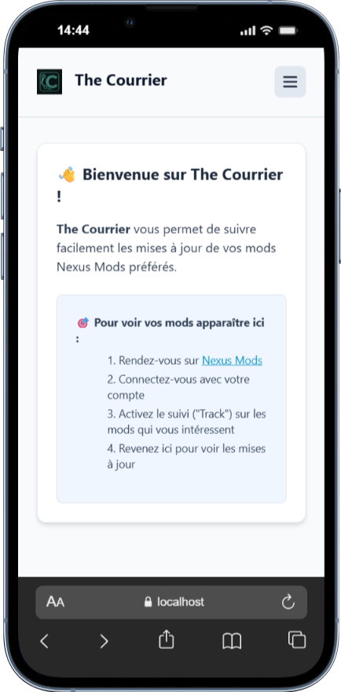
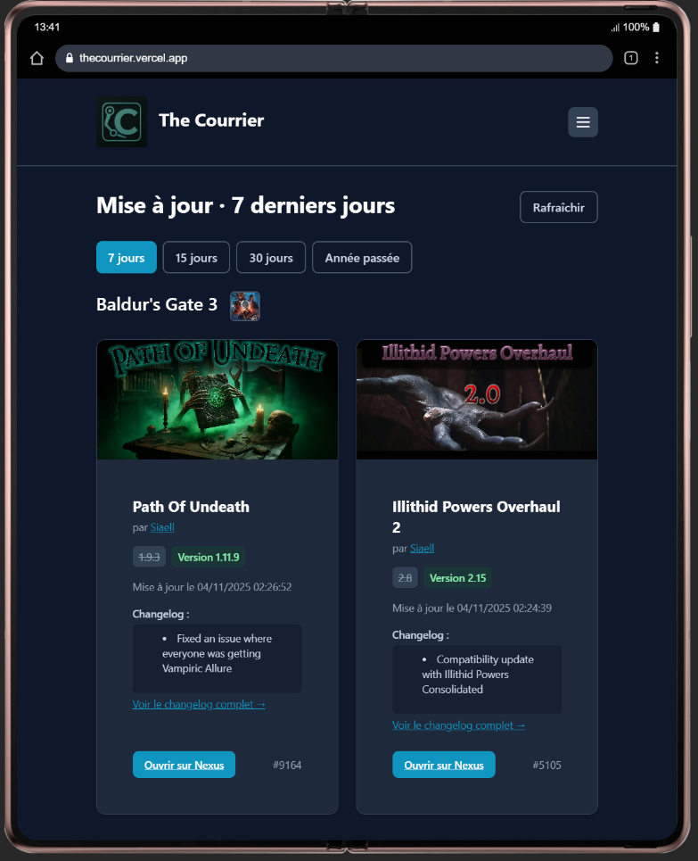
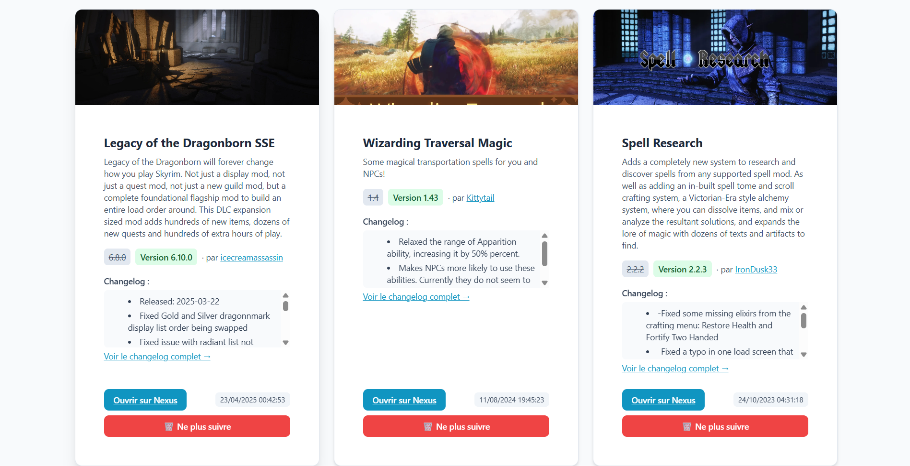
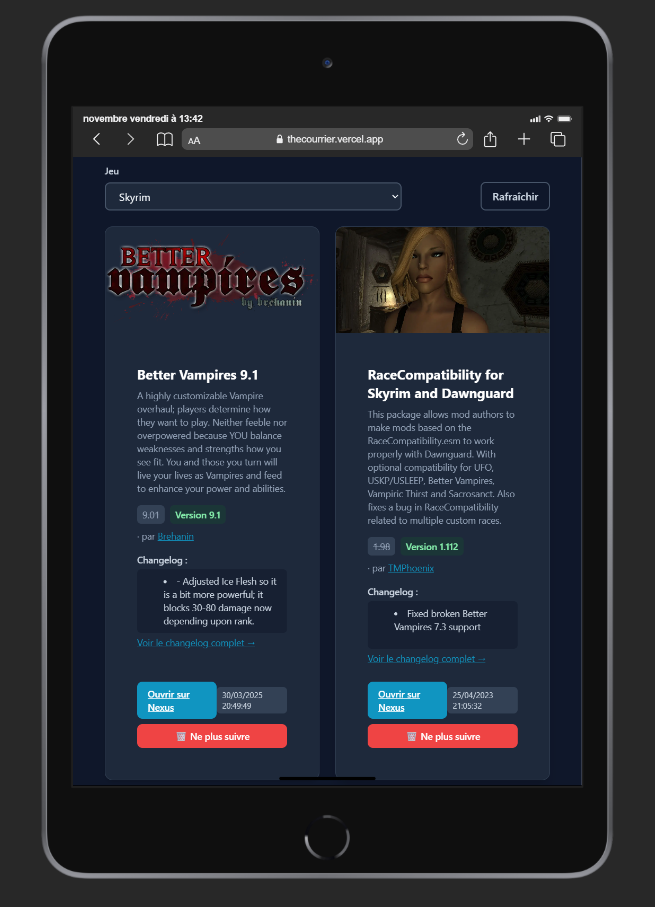
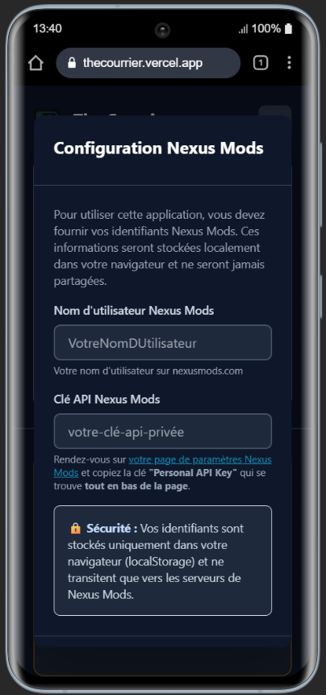

# Screenshots

Ce dossier contient les captures d'écran de l'application The Courrier.

## Images disponibles

### Homepage - Premier lancement (Mode clair)

*Page d'accueil au premier lancement avec modal de configuration des identifiants*

### Homepage - Mises à jour récentes

*Suivez les mises à jour de vos mods favoris avec un filtrage temporel avancé*

### Liste des mods (Desktop - Mode clair)

*Gérez tous vos mods suivis, organisés par jeu (version desktop)*

### Liste des mods

*Vue complète de la gestion des mods suivis*

### Configuration des identifiants

*Configuration simple et sécurisée de vos identifiants Nexus Mods*

## Comment ajouter des captures

1. Prenez des captures d'écran de l'application
2. Nommez-les de manière descriptive (ex: `feature-name-theme.png`)
3. Placez-les dans ce dossier
4. Mettez à jour ce README avec la nouvelle image
5. Mettez à jour le README principal si nécessaire
